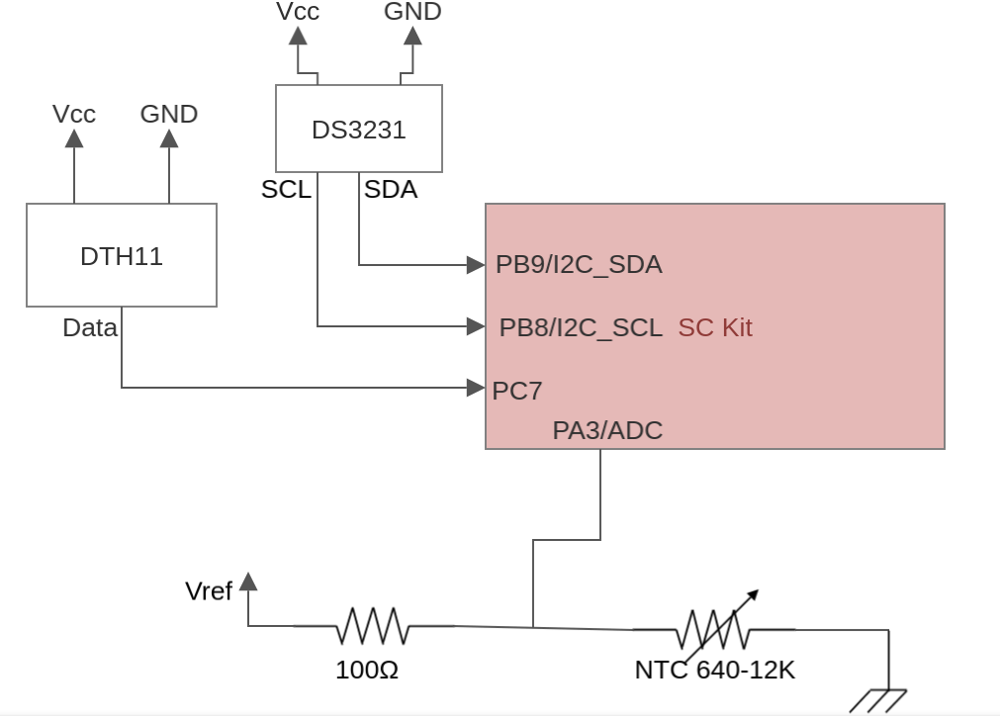
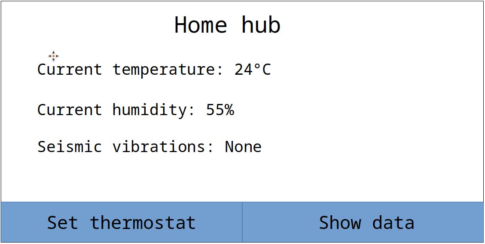
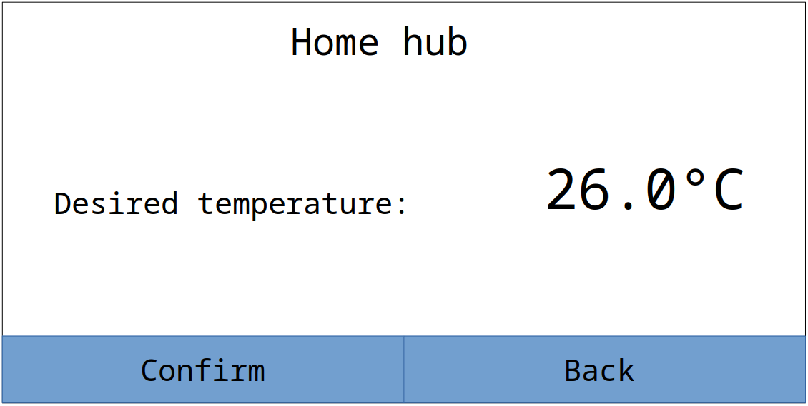
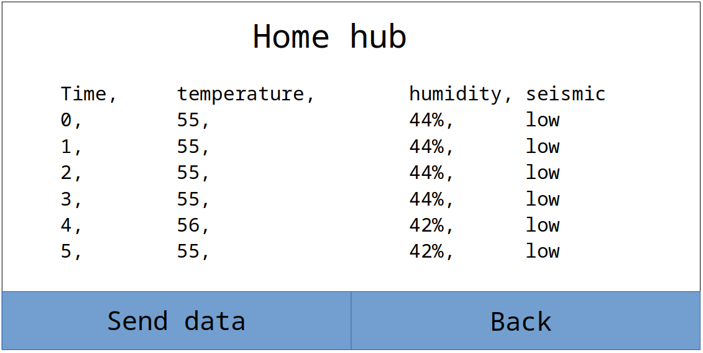

# Home hub - data collection device

Semestral project for CTU FEL subject B4M38AVS

Author: Jakub Jíra

Repository: [japawBlob/data-collection-device](https://github.com/japawBlob/data-collection-device)

## Motivation

This project aims to create a basic smart home hub for monitoring and storing useful data. Data that is being monitored is temperature, humidity and vibration. These data are then stored on an SD card. Communication via USART is also implemented for transmitting data, and requesting other services from other devices.

## Used Hardware

Microcontroller used in this project is STM32F207VC embedded in Sleepy Cat development board. This microcontroller handles all sensor data processing and communication with other devices. 

### Sensors

Measured data are: Air humidity, Temperature, and Vibrations.

The external sensor DHT11 measures humidity and temperature. It can measure temperatures ranging from 0°C to 50°C and air humidity from 20% to 90%. The sensor uses a serial interface that sends data with 16-bit resolution. Since the temperature range 0-50°C is relatively small, one NTC thermistor is connected to the microcontroller ADC to allow for a larger range of resolution.

Vibrations are measured by an internal accelerometer.

### HCI

The device implements several peripherals for interaction with the user. 

Included LCD is used for logged data presentation. Interaction with the system is implemented using a rotary encoder and two user buttons.

### Other peripherals

For data storage, even during loss of power is, used interface micro SD card. If a card with a supported file system is inserted, it will be used for logging data storage. 

If measuring the exact time is required, it is possible to connect DS3231 module to the controller's I2C interface. This module is entirely optional, and the board is able to function without it. However, if present, logged data will have more precise timestamps.

## Wiring diagram

Here is a wiring diagram for all external peripheries.

## Functionality description

### User interface

The basic user interface consists of three main screens.

#### __Main screen__

The main screen displays currently measured values. The function of user interface buttons is displayed on the bottom part of the screen. 
The rotary encoder is dormant.

By pressing set thermostat, we get to __Temperature screen__, and if we choose to show data, we will get to the __Data screen__

#### __Temperature screen__

On this screen, you can set your desired temperature. This entered temperature will be sent via USART to a connected device.

For setting temperature, the rotary encoder is used. With the left User button, we confirm the selection, and with the right, we return to the __Main screen__. If you leave this screen without confirming the new value, it will be discarded, and the original value will be kept.

#### __Data screen__

On the data screen, we can browse all logged data. We can browse all logged data using a rotary encoder as a scroll wheel. 
Logged data is stored in .csv format. After pressing the left user button, all user data will be sent in .csv format to USART. 
By pressing the right user button, we return back to __Main screen__

### Comunication format

The device strictly follows a pre-defined communication format with peripheral devices, which provide their own communication documentation. Namely [DHT11](https://components101.com/sites/default/files/component_datasheet/DHT11-Temperature-Sensor.pdf) and [DS3231](https://www.analog.com/media/en/technical-documentation/data-sheets/DS3231.pdf)

Communication via the USART device uses 0x03 character as a symbol for the End of transmission. 

The device supports the following transmissions:

#### Send temperature

When setting up the desired temperature in __Temperature screen__, confirmation of the message is sent via USART. The confirmation message contains ASCII-coded temperature in Celsius and is terminated by 0x03 character.

#### Send data

When sending data on __Data screen__, all data is sent via USART. Message respects .csv format and ends each line with a new line, and carriage return characters. The final character is 0x03 character.

#### Response on data request

The hub can also receive a command which contains "DATA" in ASCII characters, and after receiving this message, it responds by sending all data, as if the send data on __Data screen__ was pressed.

### Software behaviour

The software composes of two parts, the deterministic periodic readout of measured data and the non-deterministic handling of external communication requests and user inputs.

#### Periodic

The core of deterministic readout is a timer, which creates impulse each second, starting all sensors' readings and storing newly read data to an SD card. The periodic check also checks if there is incoming data to be read on the USART interface. The response is handled during the non-determinist window since transmitting large amounts of data could block the interrupt for a long time.

Execution of deterministic tasks has priority over non-deterministic ones.

#### Non-deterministic

The non-deterministic approach is based on handling user events, which will be interpreted based on the currently active screen. Sending data via USART is also handled in non-deterministic behaviour.
