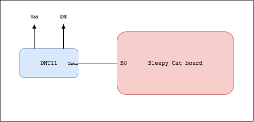
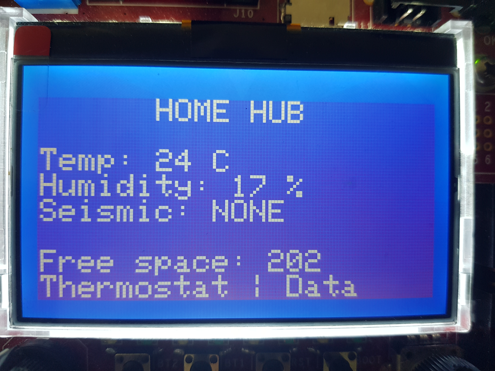
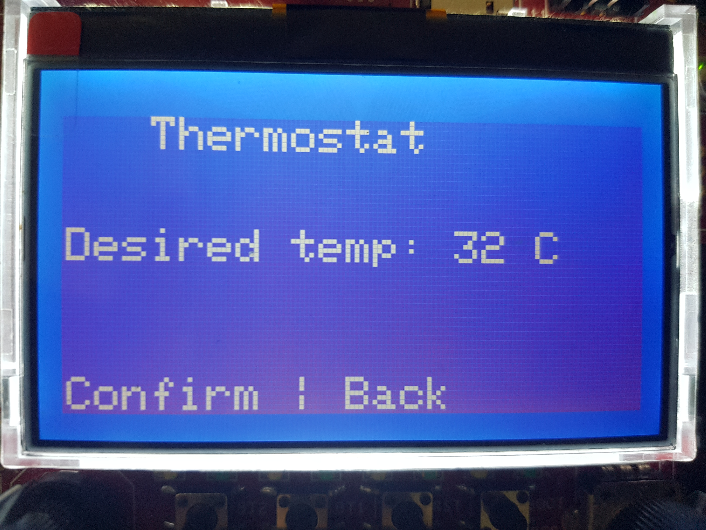

# Home hub - data collection device

Semestral project for CTU FEL subject B4M38AVS

Author: Jakub Jíra

Repository: [japawBlob/data-collection-device](https://github.com/japawBlob/data-collection-device)

# Basic device information

The project's primary goal is to create a device that could serve as an Intelligent house hub—allowing connection of other devices, data logging, and communicating with user via LCD and UART.

Current data being monitored are air humidity, air temperature, and vibrations. This data is stored on the internal EEPROM and can be sent to a connected device via USART. 

# Used hardware

The microcontroller used in this project is STM32F207VC, embedded in the Sleepy Cat development board. This microcontroller handles all sensor data processing and communication with other devices.

The connection of the peripheral device is shown in the following picture.



## Sensors 

The built-in accelerometer AIS226DS on the Sleepy Cat board measures vibrations. Accelerometer is double-axis and is connected via Serial Peripheral Interface (SPI). 

Sensor DHT11 is used for humidity and temperature measurements. It is connected to the Sleepy Cat board by a primitive custom single-bus communication protocol.

The built-in internal thermometer is also initialised but not used.

## Measuring time

For time measurement internal Real-time clock (RTC) is used. I decided against external RTC to simplify the development and use included hardware. External batteries can be connected to the built-in RTC to preserve current time even when losing the primary power source. 

## HCI

The device uses built-in peripherals in the Sleepy Cat board to provide the user interface.

For displaying information LCD RX12864D2 with built-in matrix controller ST7565 is used. It is connected via SPI. 

Built-in buttons and a rotary encoder provide interaction with a user. The exact usage is described in the [Graphical user interface](#graphical-user-interface) chapter.

## Non-volatile memory 

EEPROM module M24C64 included in Sleepy Cat board is used as non-volatile data storage. The module is connected via I2C.

# Software description

A rough diagram of the software function is described in the following picture.


You can read more about [Setup](#setup), [Accelerometer interrupt](#accelerometer-interrupt), [Read, update and store data](#read-update-and-store-data) and [Handle user input](#handling-user-input) in corresponding chapters.

## Setup

The setup consists of following initialisation routines

### UART

UART is configured as follows:
- BaudRate = 115200
- Word Length = 8b
- One stop bit
- No parity

Exact initialisation in the following code snippet:

```c++
    struct USART_InitTypeDef USART_InitStructure;

    USART_InitStructure.USART_BaudRate = 115200;
    USART_InitStructure.USART_WordLength = USART_WordLength_8b;
    USART_InitStructure.USART_StopBits = USART_StopBits_1;
    USART_InitStructure.USART_Parity = USART_Parity_No;
    USART_InitStructure.USART_HardwareFlowControl = USART_HardwareFlowControl_None;
    USART_InitStructure.USART_Mode = USART_Mode_Rx | USART_Mode_Tx;

    STM_EVAL_COMInit(com_port, &USART_InitStructure);
```

### Buttons 

Built-in Sleepy Cat buttons SW1 and SW2 are used for user interaction. 

They are initialised using the following code snippet:

```c++
    GPIO_InitTypeDef GPIO_InitStructure;
    GPIO_StructInit(&GPIO_InitStructure);

    RCC_AHB1PeriphClockCmd(RCC_AHB1Periph_GPIOC, ENABLE);

    GPIO_InitStructure.GPIO_Pin = GPIO_Pin_14 | GPIO_Pin_15;
    GPIO_InitStructure.GPIO_Mode = GPIO_Mode_IN;
    GPIO_InitStructure.GPIO_OType = GPIO_OType_PP;
    GPIO_InitStructure.GPIO_Speed = GPIO_Speed_50MHz;
    GPIO_InitStructure.GPIO_PuPd = GPIO_PuPd_UP;
    GPIO_Init(GPIOC, &GPIO_InitStructure);
```

### DHT11

For the correct DHT11 function, measuring microseconds is required. For this purpose, timer TIM2 is used and configured using the following code snippet:

```c++
    RCC_APB1PeriphClockCmd(RCC_APB1Periph_TIM2, ENABLE);
    
    TIM_TimeBaseInitTypeDef timer;
    TIM_TimeBaseStructInit(&timer);
    
    timer.TIM_CounterMode = TIM_CounterMode_Up;
    timer.TIM_ClockDivision = TIM_CKD_DIV1;
    timer.TIM_Prescaler = 59;
    timer.TIM_Period = 1000000;
    timer.TIM_RepetitionCounter = 0;
    TIM_TimeBaseInit(DHT11_TIM, &timer);
    
    TIM_ITConfig(DHT11_TIM, TIM_IT_Update, ENABLE);
    TIM_Cmd(DHT11_TIM, ENABLE);
```

The timer configured by before mentioned code snipped ticks every microsecond with the whole period lasting one second.

Pin B0 is used in both input and output modes for single-wire communication. The following snippet is used for initialising DHT11 pin:

```c++
static void set_dht11_pin(uint8_t mode){
    GPIO_InitTypeDef GPIO_InitStructure;
    GPIO_StructInit(&GPIO_InitStructure);
    RCC_AHB1PeriphClockCmd(RCC_AHB1Periph_GPIOB, ENABLE);

    GPIO_InitStructure.GPIO_Pin = DHT11_PIN;
    GPIO_InitStructure.GPIO_OType = GPIO_OType_PP;
    GPIO_InitStructure.GPIO_Speed = GPIO_Speed_100MHz;
    GPIO_InitStructure.GPIO_PuPd = GPIO_PuPd_NOPULL;
    
    if (mode == INPUT) {
        GPIO_InitStructure.GPIO_Mode = GPIO_Mode_IN;
    }
    if (mode == OUTPUT) {
        GPIO_InitStructure.GPIO_Mode = GPIO_Mode_OUT;
    }
    GPIO_Init(DHT11_GPIO, &GPIO_InitStructure);
}
```

### RTC

The real-time clock is used to create timestamps that are saved with data.

The following code snippet is used for the configuration of RTC:

```c++
    RCC_APB1PeriphClockCmd(RCC_APB1Periph_PWR, ENABLE);
    PWR_BackupAccessCmd(ENABLE);
    
    RCC_BackupResetCmd(ENABLE);
    RCC_BackupResetCmd(DISABLE);
    RTC_WriteProtectionCmd(DISABLE);
    RCC_LSICmd(ENABLE);
    
    while (RCC_GetFlagStatus(RCC_FLAG_LSIRDY) == RESET) {}
    
    RCC_RTCCLKConfig(RCC_RTCCLKSource_LSI);
    RCC_RTCCLKCmd(ENABLE);
    RTC_WaitForSynchro();
    
    RTC_InitTypeDef rtc_init;
    RTC_StructInit(&rtc_init);
    RTC_Init(&rtc_init);
    PWR_BackupAccessCmd(DISABLE);
```

### EEPROM

EEPROM initialisation is provided by the *stm32_eval_i2c_ee* library. Initialisation code is located in ```sEE_Init()``` function. This function initialises the I2C bus and sets up DMA and corresponding peripheral clocks.

### LCD

LCD initialisation setups SPI communication, sets up the brightness of the LCD, and clears it. Function ```LCD_Init()``` from library *lcd_st7565p* is used for this initialisation.

### Accellerometer

Communication with the accelerometer is initialised via the function ```sACCEL_Init()``` from the *stm32_eval_spi_accel library*. After that accelerometer is initiated, and the reading is set up to be in big-endian mode. The code is on the following snippet:

```c++
    sACCEL_Init();
    // Enable reading
    sACCEL_WriteReg(0x20, 0x83);
    // Set Big endian mode
    uint8_t b = sACCEL_ReadReg(0x21);
    b |= 0x20;
    sACCEL_WriteReg(0x21, b);
```

Accelerometer in this application is used to monitor vibrations. For this functionality, periodic reading of acceleration is required to determine the amount of vibrations. Timer TIM5 is used for this periodic reading of vibrations. A timer is set to generate an interrupt every 50ms. 

The following snipped is used for timer initialisation:

```c++
    RCC_APB1PeriphClockCmd(RCC_APB1Periph_TIM5, ENABLE);
    
    //Enabeling timer interrupt
    NVIC_InitTypeDef blob;
    blob.NVIC_IRQChannel = TIM5_IRQn;
    blob.NVIC_IRQChannelPreemptionPriority = 8;
    blob.NVIC_IRQChannelSubPriority = 0;
    blob.NVIC_IRQChannelCmd = ENABLE;
    NVIC_Init(&blob);
    
    //Enabeling timer TIM_3
    TIM_TimeBaseInitTypeDef timer;
    
    timer.TIM_CounterMode = TIM_CounterMode_Up;
    timer.TIM_ClockDivision = TIM_CKD_DIV1;
    timer.TIM_Prescaler = 59;
    timer.TIM_Period = 1000*50;
    timer.TIM_RepetitionCounter = 0;
    TIM_TimeBaseInit(TIM5, &timer);
    TIM_ClearITPendingBit(TIM5, TIM_IT_Update);
  
    TIM_Cmd(TIM5, ENABLE);
    TIM_ITConfig(TIM5, TIM_IT_Update, ENABLE);
```

### Logger

Logger is a custom library written for this project. It serves the purpose of creating new data entries and managing memory. 

Initialisation of this library consists of creating an array for storing data entries, reading EEPROM memory for any already present data, loading it, and determining the next available address. 

### Encoder

Encoder is used with timer TIM4 in encoder mode. The initialisation of the encoder can be seen in the following snippet:

```c++
/* Initialize the corresponding input pins */
        GPIO_InitTypeDef GPIO_InitStructure;
/* Enable clock to GPIOD */
        RCC_AHB1PeriphClockCmd(RCC_AHB1Periph_GPIOD, ENABLE);
        GPIO_StructInit(&GPIO_InitStructure);
        GPIO_InitStructure.GPIO_PuPd = GPIO_PuPd_UP;
        GPIO_InitStructure.GPIO_Mode = GPIO_Mode_AF;
        GPIO_InitStructure.GPIO_OType = GPIO_OType_PP;
        GPIO_InitStructure.GPIO_Pin = GPIO_Pin_12 | GPIO_Pin_13;
        GPIO_InitStructure.GPIO_Speed = GPIO_Speed_50MHz;
        GPIO_Init(GPIOD, &GPIO_InitStructure);
        GPIO_PinAFConfig(GPIOD, GPIO_PinSource12, GPIO_AF_TIM4);
        GPIO_PinAFConfig(GPIOD, GPIO_PinSource13, GPIO_AF_TIM4);

/* Initialize the timer */
/* Enable clock to TIM4 */
        RCC_APB1PeriphClockCmd(RCC_APB1Periph_TIM4, ENABLE);

        TIM_TimeBaseInitTypeDef TIM_InitStructure;
        TIM_TimeBaseStructInit(&TIM_InitStructure);
        TIM_InitStructure.TIM_ClockDivision = TIM_CKD_DIV1;
        TIM_InitStructure.TIM_Period = 0xFFFF;
        TIM_InitStructure.TIM_Prescaler = 0;
        TIM_InitStructure.TIM_CounterMode = TIM_CounterMode_Up;
        TIM_TimeBaseInit(TIM4, &TIM_InitStructure);

/* Set the timer up for quadrature decoding */
        TIM_EncoderInterfaceConfig(TIM4, TIM_EncoderMode_TI12, TIM_ICPolarity_Rising, TIM_ICPolarity_Rising);
        TIM4->CNT = ENCODER_COUNTER_ZERO;
        TIM_Cmd(TIM4, ENABLE);
```

## Main loop

The main loop of the program consists of three functionalities. 

### Accelerometer interrupt

The first one is checking the accelerometer interrupt. If it occurred, the current value is recorded. Twenty samples are recorded before the next functionality is executed. The minimum and maximum from recorded data determine the amount of seismic vibrations. 

### Read, update and store data

The second functionality happens after twenty accelerometer interrupts. During the interrupt new data record is created and stored. Data entry looks followingly:

```c++
struct data_entry {
    uint8_t time_stamp;
    int8_t temperature;
    uint8_t humidity;
    uint8_t vibrations;
};
```

The timestamp represents the current seconds received from the RTC. Temperature is received from the DHT11 sensor as well as humidity. 
Vibrations are determined by comparing the minimum and maximum recorded from the accelerometer during the previous step. 

The value of the accelerometer is measured in four levels. None, low, medium, and high. For representing this amount, the following enum is used:

```c++
enum {SEISMIC_NONE, SEISMIC_LOW, SEISMIC_MEDIUM, SEISMIC_HIGH};
```

This created entry is then stored to EEPROM, and temporary variables such as interrupt counter and accelerometer minimum and maximum are cleared. Also, the GUI scene is updated to display the newest data.

The following snippet represents the second functionality:

```c++
    struct data_entry new_entry;
    struct DHT11_response resp = read_DHT11();
    new_entry.temperature = resp.integral_T;
    new_entry.humidity = resp.integral_RH;
    new_entry.vibrations = accelerometer_state.current_vibration;
    clear_accelerometer();
    RTC_TimeTypeDef time;
    RTC_GetTime(0, &time);
    new_entry.time_stamp = time.RTC_Seconds;
    append_mem_entry(new_entry);

    counter = 0;
    update_scene();
    report_count++;
```

### Handling user input

When the user buttons are pressed, the encoder changes its position, or a message is received on USART; this function handles that event. 

The currently active scene influences buttons' and encoders' behavior - more information in [Graphical user interface](#graphical-user-interface).

The application currently accepts two kinds of messages on USART. Both are one-byte words, one is ```0xcc```, and the other is ```0xdd```

After receiving ```0xcc```, the application clears all stored data. 

After receiving ```0xdd```, the application responds with all recorded data displayed in .csv format. 

# Graphical user interface

The graphical interface consists of three screens, which provide user interaction via two buttons and a single rotary encoder. The screens are named [Home hub](#home-hub), [Set thermostat](#set-thermostat), [Data](#data-screen).

## Home hub



The primary purpose of **Home hub** is to provide current information. The information displayed is refreshed every second or earlier when expected user input is received.

Displayed values are temperature in $\degree C$, air humidity in $\%$, and seismic activity stated verbally using four levels of seismic: NONE, LOW, MID, and HIGH. 

With values logged, it is also displayed free space that is left on the EEPROM. 

User button 2 will open [Set thermostat](#set-thermostat), and user button 1 will open [Data](#data-screen).

On this screen, the rotary encoder is dormant.

## Set thermostat



The idea behind the Thermostat screen is, if connected to the device, that controls external temperature - such as a thermostat or an air conditioner; using this functionality, we can set the new desired temperature utilizing this device. 

User button 2 sends the currently displayed temperature on the screen to UART. User button 1 will take us back to the [Home hub](#home-hub) screen. 

The rotary encoder is used to modify the currently displayed temperature. Clockwise rotations increment, and counterclockwise rotations decrement the displayed temperature.

## Data


The data screen contains all recordings with corresponding timestamps.

The rotary encoder is used as a scroll wheel to go through all data entries. 

Pressing user button 2 sends all data to USART in .csv format. Pressing user button 1 takes us back to the [Home hub](#home-hub) screen.

# Conclusion

The main goal of this project was to create a device that would be able to log data, display it and provide a communication interface so that the data could be processed elsewhere. 

From the first draft project was a little bit simplyfied. The usage of the external real-time clock was omitted in favour of the internal real-time clock. Incoming communication messages were also simplified to single-byte messages. The integrated thermistor proved to be quite inaccurate for temperature reading, and temperature reading from sensor DHT11 was used instead.

Using mentioned simplifications allowed me to focus on functioning code, which works as expected without any side effects.

Improvement could be achieved by unifying all custom-made libraries. Some pass values as global variables, whereas others provide them via getters and setters. 

Besides the inconsistency in libraries, I am pretty happy with the result and overall application. 
