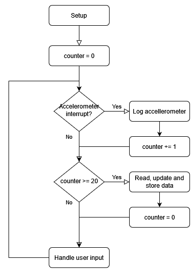

# Home hub - data collection device

Semestral project for CTU FEL subject B4M38AVS

Author: Jakub Jíra

Repository: [japawBlob/data-collection-device](https://github.com/japawBlob/data-collection-device)

# Basic device information

The main goal of the project is to create a device, that could serve as Inteligent house hub. Allowing connection of other devices, data logging and communicating with user via LCD and UART.

Current data being motitored are air humidity, air temperature and vibrations. This data is stored on internal EEPROM, as well as it can be sent to connected device via USART. 

# Used hardware

Microcontroller used in this project is STM32F207VC embedded in Sleepy Cat development board. This microcontroller handles all sensor data processing and communication with other devices.

Connection of the peripheral device is show in the following picture.


## Sensors 

For measuring vibrations the built-in accellerometer AIS226DS on Sleepy Cat board is used. Accelerometer is double axis and is connected via Serial Peripheral Interface (SPI). 

Sensor DHT11 is used for humidity and temperature mesaurements. It is connected to the Sleepy Cat board by primitive custom single-bus communication protocol.

Internal built-in thermometer is also initialised, but not used.

## Measuring time

For time measurement internal Real-time clock (RTC) is used. I decided againts external RTC in order to simplify the developement and to use included hardware. External battery can be connected to the built-in RTC to preserve current time even in the case of loosing the main power source. 

## HCI

Device uses built-in peripherals in Sleepy Cat board to provide user interface.

For displaying information LCD RX12864D2 with built in matrix controller ST7565 is used. It is connected via SPI. 

Interaction with user is provided by built in buttons and rotary encoder. Exact usage described in [Graphical user interface](#graphical-user-interface).

## Non-volatile memory 

EEPROM module M24C64 included in Sleepy Cat board is used as non-volatile data storage. Module is connected via I2C.

# Software description

Rough diagram of the software function is described in the following picture.



## Setup

Setup consists of following innitialisation routines

### UART

UART is configured as follow:
- BaudRate = 115200
- Word Length = 8b
- One stop bit
- No parity

Exact initialisation in following code snippet:

```c++
    struct USART_InitTypeDef USART_InitStructure;

    USART_InitStructure.USART_BaudRate = 115200;
    USART_InitStructure.USART_WordLength = USART_WordLength_8b;
    USART_InitStructure.USART_StopBits = USART_StopBits_1;
    USART_InitStructure.USART_Parity = USART_Parity_No;
    USART_InitStructure.USART_HardwareFlowControl = USART_HardwareFlowControl_None;
    USART_InitStructure.USART_Mode = USART_Mode_Rx | USART_Mode_Tx;

    STM_EVAL_COMInit(com_port, &USART_InitStructure);
```

### Buttons 

Buttons SW1 and SW2, that are built-in on Sleepy Cat board are used for user interaction. 

They are initialised using following code snippet:

```c++
    GPIO_InitTypeDef GPIO_InitStructure;
    GPIO_StructInit(&GPIO_InitStructure);

    RCC_AHB1PeriphClockCmd(RCC_AHB1Periph_GPIOC, ENABLE);

    GPIO_InitStructure.GPIO_Pin = GPIO_Pin_14 | GPIO_Pin_15;
    GPIO_InitStructure.GPIO_Mode = GPIO_Mode_IN;
    GPIO_InitStructure.GPIO_OType = GPIO_OType_PP;
    GPIO_InitStructure.GPIO_Speed = GPIO_Speed_50MHz;
    GPIO_InitStructure.GPIO_PuPd = GPIO_PuPd_UP;
    GPIO_Init(GPIOC, &GPIO_InitStructure);
```

### DHT11

For correct DHT11 function, measuring micro seconds is requiered. For this purpose timer TIM2 is used and configured using following code snippet:

```c++
    RCC_APB1PeriphClockCmd(RCC_APB1Periph_TIM2, ENABLE);
    
    TIM_TimeBaseInitTypeDef timer;
    TIM_TimeBaseStructInit(&timer);
    
    timer.TIM_CounterMode = TIM_CounterMode_Up;
    timer.TIM_ClockDivision = TIM_CKD_DIV1;
    timer.TIM_Prescaler = 59;
    timer.TIM_Period = 1000000;
    timer.TIM_RepetitionCounter = 0;
    TIM_TimeBaseInit(DHT11_TIM, &timer);
    
    TIM_ITConfig(DHT11_TIM, TIM_IT_Update, ENABLE);
    TIM_Cmd(DHT11_TIM, ENABLE);
```

By this configuration timer ticks every micro second, with whole period lasting one second.

For single wire communication B0 pin is used in both input and output mode. Following snippet is used for initialising DHT11 pin:

```c++
static void set_dht11_pin(uint8_t mode){
    GPIO_InitTypeDef GPIO_InitStructure;
    GPIO_StructInit(&GPIO_InitStructure);
    RCC_AHB1PeriphClockCmd(RCC_AHB1Periph_GPIOB, ENABLE);

    GPIO_InitStructure.GPIO_Pin = DHT11_PIN;
    GPIO_InitStructure.GPIO_OType = GPIO_OType_PP;
    GPIO_InitStructure.GPIO_Speed = GPIO_Speed_100MHz;
    GPIO_InitStructure.GPIO_PuPd = GPIO_PuPd_NOPULL;
    
    if (mode == INPUT) {
        GPIO_InitStructure.GPIO_Mode = GPIO_Mode_IN;
    }
    if (mode == OUTPUT) {
        GPIO_InitStructure.GPIO_Mode = GPIO_Mode_OUT;
    }
    GPIO_Init(DHT11_GPIO, &GPIO_InitStructure);
}
```

### RTC

Real time clock is used for creation of timestamps, that are saved with data.

Following code snippet is used for configuration of RTC:

```c++
    RCC_APB1PeriphClockCmd(RCC_APB1Periph_PWR, ENABLE);
    PWR_BackupAccessCmd(ENABLE);
    
    RCC_BackupResetCmd(ENABLE);
    RCC_BackupResetCmd(DISABLE);
    RTC_WriteProtectionCmd(DISABLE);
    RCC_LSICmd(ENABLE);
    
    while (RCC_GetFlagStatus(RCC_FLAG_LSIRDY) == RESET) {}
    
    RCC_RTCCLKConfig(RCC_RTCCLKSource_LSI);
    RCC_RTCCLKCmd(ENABLE);
    RTC_WaitForSynchro();
    
    RTC_InitTypeDef rtc_init;
    RTC_StructInit(&rtc_init);
    RTC_Init(&rtc_init);
    PWR_BackupAccessCmd(DISABLE);
```

### EEPROM

EEPROM initialisation is provided by *stm32_eval_i2c_ee* library. Initialisation code is located in ```sEE_Init()``` function. This function initialises I2C bus, and sets up DMA and corresponding peripheral clocks.

### LCD

LCD initialisation setups SPI communication, sets up brightness of the LCD and clears it. Function ```LCD_Init()``` from library *lcd_st7565p* is used for this initialisation.

### Accellerometer

Communication with accelerometer is initialised via function ```sACCEL_Init()``` from *stm32_eval_spi_accel library*. After that accelerometer is initiated and reading is set up to be in big endian mode. Code is on the following snippet:

```c++
    sACCEL_Init();
    // Enable reading
    sACCEL_WriteReg(0x20, 0x83);
    // Set Big endian mode
    uint8_t b = sACCEL_ReadReg(0x21);
    b |= 0x20;
    sACCEL_WriteReg(0x21, b);
```

Accelerometer in this application is used to monitor vibrations. For this functionality, periodic reading of acceleration is required to determine amount of vibrations. Timer TIM5 is used for this periodic reading of vibrations. Timer is set to generate interrupt every 50ms. 

Following snipped is used for timer initialisation:

```c++
    RCC_APB1PeriphClockCmd(RCC_APB1Periph_TIM5, ENABLE);
    
    //Enabeling timer interrupt
    NVIC_InitTypeDef blob;
    blob.NVIC_IRQChannel = TIM5_IRQn;
    blob.NVIC_IRQChannelPreemptionPriority = 8;
    blob.NVIC_IRQChannelSubPriority = 0;
    blob.NVIC_IRQChannelCmd = ENABLE;
    NVIC_Init(&blob);
    
    //Enabeling timer TIM_3
    TIM_TimeBaseInitTypeDef timer;
    
    timer.TIM_CounterMode = TIM_CounterMode_Up;
    timer.TIM_ClockDivision = TIM_CKD_DIV1;
    timer.TIM_Prescaler = 59;
    timer.TIM_Period = 1000*50;
    timer.TIM_RepetitionCounter = 0;
    TIM_TimeBaseInit(TIM5, &timer);
    TIM_ClearITPendingBit(TIM5, TIM_IT_Update);
  
    TIM_Cmd(TIM5, ENABLE);
    TIM_ITConfig(TIM5, TIM_IT_Update, ENABLE);
```

### Logger

Logger is a custom library written for this project. It serves the purpose of creating new data entries and managing memory. 

Initialisation of this library consists of creating an array for storing data entries, reading EEPROM memory for any already present data, loading it, and determining the next available address. 

### Encoder

Encoder is used with timer TIM4 in encoder mode. The initialisation of encoder can be seen in following snippet:

```c++
/* Initialize the corresponding input pins */
        GPIO_InitTypeDef GPIO_InitStructure;
/* Enable clock to GPIOD */
        RCC_AHB1PeriphClockCmd(RCC_AHB1Periph_GPIOD, ENABLE);
        GPIO_StructInit(&GPIO_InitStructure);
        GPIO_InitStructure.GPIO_PuPd = GPIO_PuPd_UP;
        GPIO_InitStructure.GPIO_Mode = GPIO_Mode_AF;
        GPIO_InitStructure.GPIO_OType = GPIO_OType_PP;
        GPIO_InitStructure.GPIO_Pin = GPIO_Pin_12 | GPIO_Pin_13;
        GPIO_InitStructure.GPIO_Speed = GPIO_Speed_50MHz;
        GPIO_Init(GPIOD, &GPIO_InitStructure);
        GPIO_PinAFConfig(GPIOD, GPIO_PinSource12, GPIO_AF_TIM4);
        GPIO_PinAFConfig(GPIOD, GPIO_PinSource13, GPIO_AF_TIM4);

/* Initialize the timer */
/* Enable clock to TIM4 */
        RCC_APB1PeriphClockCmd(RCC_APB1Periph_TIM4, ENABLE);

        TIM_TimeBaseInitTypeDef TIM_InitStructure;
        TIM_TimeBaseStructInit(&TIM_InitStructure);
        TIM_InitStructure.TIM_ClockDivision = TIM_CKD_DIV1;
        TIM_InitStructure.TIM_Period = 0xFFFF;
        TIM_InitStructure.TIM_Prescaler = 0;
        TIM_InitStructure.TIM_CounterMode = TIM_CounterMode_Up;
        TIM_TimeBaseInit(TIM4, &TIM_InitStructure);

/* Set the timer up for quadrature decoding */
        TIM_EncoderInterfaceConfig(TIM4, TIM_EncoderMode_TI12, TIM_ICPolarity_Rising, TIM_ICPolarity_Rising);
        TIM4->CNT = ENCODER_COUNTER_ZERO;
        TIM_Cmd(TIM4, ENABLE);
```

## Main loop

The main loop of program consists of checking 3 functionalities. 

### Read, update and store data

### Handling user input


# Graphical user interface


