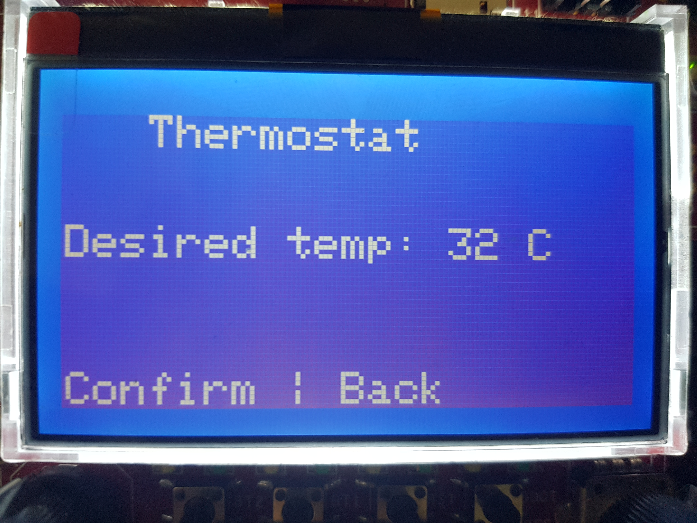

<!--
header: ''
footer: 'Created using Marp'
paginate: false
-->

<!--#
Co budeme probírat? Nebudu Vás učit jak vypadá for cyklus, ale trochu bych s Váma chtěl projít problematiku toho, proč nemáme jen jeden programovací jazyk. 

Nechci z Vás udělat programátory, ale spíš Vám dát nějakej rozhled ohledně toho, co se vlastně děje, a kdybyste se s programátorama bavili, tak ať jim aspoň trochu rozumíte - Alza story
-->

# Data collection device

Jakub Jíra
[github.com/japawBlob](https://github.com/japawBlob)

---

<!--
header: 'Data collection device'
footer: '[japawBlob/data-collection-device](https://github.com/japawBlob/data-collection-device)'
paginate: true
-->

# Goal of project

Logging temperature, humidity, vibrations

Measuring time

Displaying logged data

---

# Measuring values 

For temperature and humidity: sensor DHT11

Internal temperature sensor highly innacurate

Built in accelerometer for virbrations

---

# Measuring time

Originally wanted to use DS3231 for RTC

In application build in RTC is used

---

# Displaying logged data

Data is stored in EEPROM memory

Able to be read out using UART in .csv format

Or directly on display

---

# User interface

## Home hub

---

# User interface

## Thermostat

---

# User interface

## Data screen

